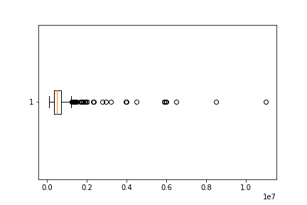
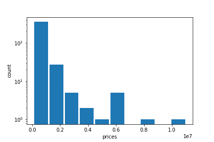
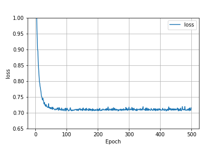
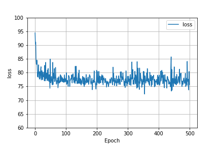
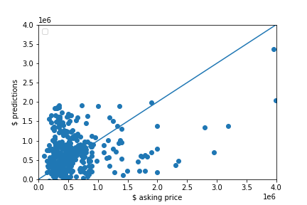
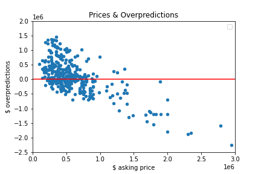

# Project_1

## Arlington, Texas

For my project I decided to scrape 400 observations off Zillow for the city of Arlington in Texas. After cleaning the housing data and extracting variables [prices, beds, baths, sqft, zip] I noticed that the zip code column had a few missing values which I decided to manually key in. 
When I first ran the model without the spatial variable ‘zip’ the MSE was 792,222,497,120. 
To lower the MSE I decided to use the spatial variable, Standard Scaler and the Min Max Scaler. The standard scaler yielded the lower MSE which was 738,784,367,300. While this MSE is very high it was the lowest out of all the trials I did.

Below are some descriptive statistics:

Above you can see that 75% of my data comprised of houses with prices less than $700,000 and the max price $10,995,000 so I decided to do make a boxplot.

There are 99 observations with a price greater than $700,000 so we initially had 99 potential outliers.
After calculating the IQR range I calculated the upper fence which is $1,240,045. This left my dataset with 40 definite outliers (10% of whole). I decided to keep these data points because they were a sizeable chunk of my dataset. 

Below is a log transformed histogram of the Arlington housing prices. The shape of the graph distribution shows that there are a lot of homes in the lower price range and very few homes in the higher price range.

## Model Architecture 

I tried a few different approaches. First I tried a model without the zipcode and without scaling the data, a model with the zipcode and unscaled data, and finally two models with the Standard Scaler and the MinMax Scaler.
The model that used the standard scaler was the best performer with an expectedly high MSE of 738,784,367,300 due to the outliers.
Below is a code snippet:

    from sklearn.preprocessing import StandardScaler as SS
    ss = SS()
    # homes = pd.read_csv('out.csv')
    homes = pd.read_csv('TX.csv')
    homes.columns

    homes_scaled = ss.fit_transform(homes)

    homes_scaled = pd.DataFrame(homes_scaled, columns = ['prices', 'beds', 'baths', 'sqft', 'zip'])
    homes_scaled.head()

    model = tf.keras.Sequential([keras.layers.Dense(units=1, input_shape=[4])])
    model.compile(optimizer='sgd', loss='mean_squared_error')

    x1 = homes_scaled['beds'] # number of beds
    x2 = homes_scaled['baths'] #number of baths
    x3 = homes_scaled['sqft'] #sqft
    x4 = homes_scaled['zip']
    xs = np.stack([x1,x2,x3,x4], axis=1)
    ys = homes_scaled['prices'] #price

    history = model.fit(xs, ys, epochs=500)
    p = model.predict(xs)
    p = np.concatenate([p, xs], axis=1)
    p_back = ss.inverse_transform(p)

Below is a graph that shows how the MSE was affected as we increased the number of epochs. It is clear that after about the first 50 epochs that the model failed to improve its predictive capability.

Here is also a graph of the loss function when the model had basic scaled data and no spatial variable. The behavior of the graphs are the same. This probably means that even though the MSE was lowered by using standard scaled data and a spatial variable, these factors were unable to improve the model's ability to predict. 

## Model Output Analysis

The graph below is a scatter plot of the asking price and the predictions. It's clear that the model is barely moderately good at predicting lower priced homes based on point proximity to the 45 degree line in the lower left corner of the graph. The model's predictive power became significantly worse as homes increased in price.

## Analysis of the output that assesses and ranks all homes from best to worst deal.

I created a columm that would compute how much the value of a home was overpredicted by subtracting the observed price from the predicted price and then used the code below to see how many values were above 0. 230 home values were overpredicted so my model had a tendency to overpredict.

    homes[homes['overpredict'] > 0].count()

On the chart below any data point above 0 is according to the model overpriced and anything below 0 is underpriced/a good deal. It is hard to see but there are exactly 230 points above 0 and 170 points below 0. As you move up and further away from 0 the more bad deals you will find and vice-versa.

Perhaps removing the outliers would increase model performance but i wanted to keep up to the 400 observation minimum requirement
