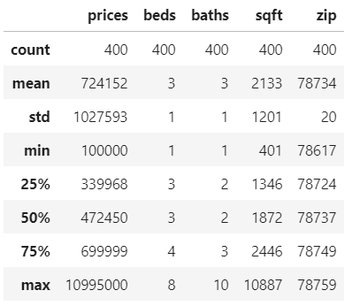

# Project_1

## Arlington, Texas

For my project I decided to scrape 400 observations off Zillow for the city of Arlington in Texas. After cleaning the housing data and extracting variables [prices, beds, baths, sqft, zip] I noticed that the zip code column had a few missing values which I decided to manually key in. 
When I first ran the model without the spatial variable ‘zip’ the MSE was 792,222,497,120. 
To lower the MSE I decided to use the spatial variable, Standard Scaler and the Min Max Scaler. The standard scaler yielded the lower MSE which was 738,784,367,300. While this MSE is very high it was the lowest out of all the trials I did.

Below are some descriptive statistics:

Above you can see that 75% of my data comprised of houses with prices less than $700,000 and the max price $10,995,000 so I decided to do make a boxplot.

